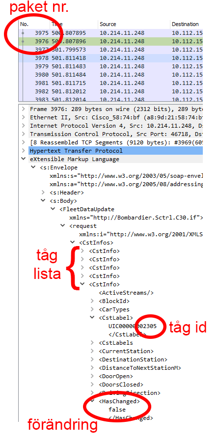
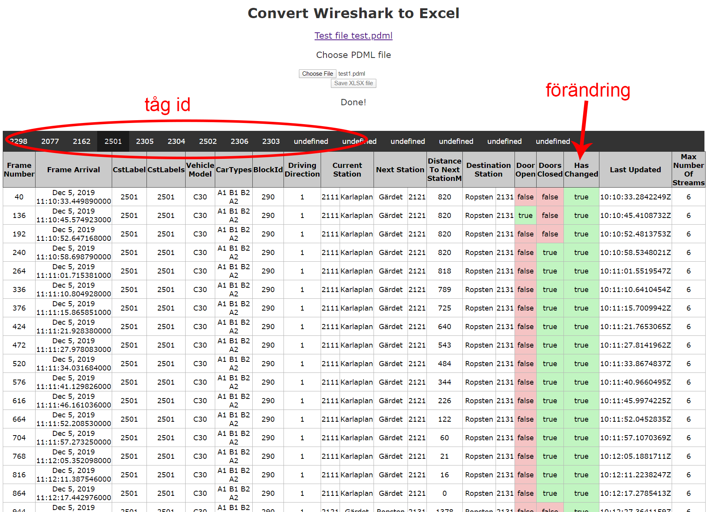

# Samuels python-projekt

Hemsida: https://wireshark2excel.now.sh/

Testfil: https://abbindgym-my.sharepoint.com/:u:/g/personal/samuel_staflin_abbindustrigymnasium_se/EewT05J4P5pNviiJVfEyvBEBXM87ury8ovQ0BhteksX0Jg?e=IzMrfP

## Problem
SL håller just nu på och tester deras nya överbevakningssystem i Stockholm tunnelbana. Vid tester av det nya systemet använder de sig av en simulator de har skapat för att testa så kamerorna fungerar. Dessa simulatorer loggar händelserna i stora Wireshark filer som är väldigt ineffektiva att läsa av. Då har jag tagit mig an uppgiften att lösa detta. 

Denna testfil är relativt liten. Varje paket är en uppdataring. Varje uppdatering innehåller information om varje tåg (varje flik i tåglistan kallas "consist". Det flesta tåg innehåller inte någon ny information (förändring). Men föt att komma åt någon information behöver öppna flera flikar och leta sig fram. Detta är väldigt ineffektvt då man behöver leta sig fram till tåglistan, sedan behöver man se om "hasChanged" är "true" (vilket ungefär var 8e är). Allt de jobbet för att få fram lite information ur ett packet, som de sedan finns flera tusen av att kolla igenom. (helt sjukt hur ineffektivt det är)

Tidigare har jag testat att göra ett python-program som gör ett excel dokument av informationen. Programmet fungerade till viss del. Jag fick problem när jag skulle göra om programmet till en EXE fil som vem som helst skulle kunna ladda ner. Anti-virus programmen gillade tydligen inte mitt program. 

## Lösning
För att läsa detta tänkte jag göra en hemsida som istället strukturerar informationen i tabeller. Genom en hemsida så kan vem som helst komma åt den. Utan att behöva installera något på datorn. 

För att göra det tydligt så har jag valt att rensa bort alla uppdateringar där ingen ny information presentaras. Jag har även valt att sortara tabbelerna utifrån vilket tågs information som presenteras.
På bilden syns det hur "Distance to next station" börjar minska efter att "Doors CLosed" blir sant.

Med detta program blev 4000, så kallade consiter, till 60 rader i 7 olika tabbeler.
